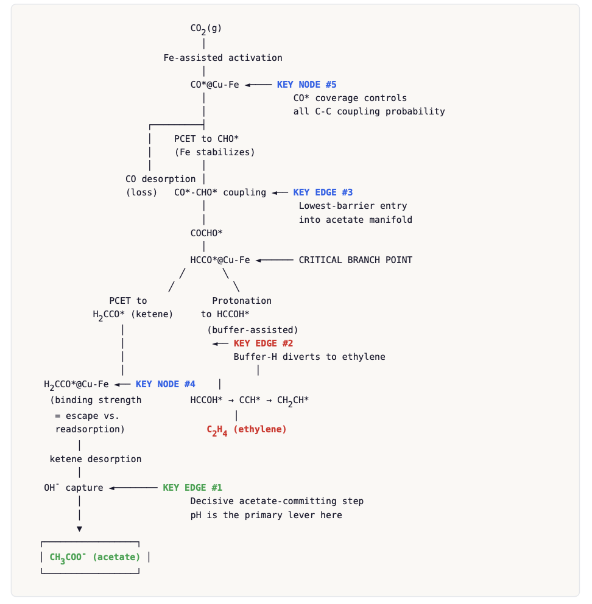

# CoThinker Preview — Scientific Reasoning on Live Experimental Data

**Connect with your experimental spectral data and refine molecular design hypotheses directly from Claude Chat**

CoThinker is a multi-stage reasoning system that generates structured reaction network hypotheses and tests them against real experimental data. The hypothesis is a falsifiable artifact — a reaction network with species, pathways, spectral signatures, and per-condition predictions.

This preview release includes:
- **Example reports** from the autonomous hypothesis generation pipeline (two chemistries with different mechanistic landscapes)
- **Demo data** — real operando Raman spectra from CO₂ electroreduction on Cu-Fe
- **An MCP server** that connects Claude to spectral data for real-time hypothesis cross-referencing

---

## What CoThinker Produces

These reports were generated autonomously by our upstream reasoner. 

### CO₂ Electroreduction to Acetate on Cu-Fe

<!-- INSTRUCTION: Screenshot of the reaction network diagram from the CO2 report -->
[](reports/co2_acetate_cufe.pdf)

32-node reaction network. 3 self-critique iterations with substantive refinements. The system identified \*COOH as the selectivity-controlling branch point and predicted that Fe sites lower the C-C coupling barrier for acetate over ethylene — a testable, falsifiable claim grounded in the reaction network topology.

**[→ View full report (PDF)](reports/co2_acetate_cufe.pdf)**

---

### Selective Butane Hydrogenolysis on Ni-Cu/SiO₂

<!-- INSTRUCTION: Screenshot of the reaction network or selectivity map from the Ni-Cu report -->
[](reports/butane_hydrogenolysis_nicu.pdf)

144 enumerated pathways. Informed by prior-run experimental feedback. The system learned from a previous run that proposed a Cu-rich composition contradicting expert preferences — this run integrated that feedback through persistent memory, producing a Ni-rich recommendation consistent with the experimental constraints.

**[→ View full report (PDF)](reports/butane_hydrogenolysis_nicu.pdf)**

---

## Try It in 60 Seconds

The repo includes real operando Raman spectra from CO₂ electroreduction on a Cu-Fe electrode. No setup beyond pip install.

```bash
cd cothink-preview/mcp
python -m venv venv && source venv/bin/activate
pip install -r requirements.txt
python run_server.py --data-root ../demo_data/co2_acetate --port 8765 --no-ngrok
```

Add `http://localhost:8765/sse` as an MCP connector in Claude.ai (name it "ChemReasoner"), then start a chat, example questions:

> *"List the available experiments and tell me what the hypothesis predicts for the -0.56V condition."*

> *"Analyze scan 5. What peaks do you see, and what can't you account for?"*

> *"Track CO₂ and formate across all scans. Is anything changing over time?"*

> *"Compare scan 1 to the initial baseline. What appeared since electrolysis started?"*

> *"Generate the full hypothesis test report."*

---

## What Happens Next: Testing Hypotheses Against Real Data

The reports above produce structured hypothesis JSONs. The MCP server below consumes them — connecting Claude to your spectra so you can interrogate every prediction against what you actually measured.

### Annotated Spectrum with Blind-Spot Guard

<!-- INSTRUCTION: Screenshot of an annotated spectrum showing assigned + unassigned peaks -->
[](#)

Peaks are assigned to hypothesis species and reference library entries. Strong unassigned peaks are flagged for investigation — the system is designed to surface what you weren't looking for.

### Hypothesis vs Observation

<!-- INSTRUCTION: Screenshot of the comparison matrix (checkmark/x/! grid) -->
[](#)

Each condition gets a verdict: confirmed, partially confirmed, or inconsistent. Missing predicted species and unexpected detections are called out explicitly.

---

## Using Your Own Data

### Data Directory Structure

```
your-data-directory/
    hypothesis/
        your_hypothesis.json
    YYYY-MM-DD/
        Condition_A/
            *.txtr            # BWTek Raman spectra
        Condition_B/
            *.txtr
```

```bash
python run_server.py --data-root /path/to/your/data --port 8765
```

For remote access (e.g., connecting from Claude.ai to a lab machine), set `NGROK_AUTHTOKEN` and omit `--no-ngrok`.

### Validate Your Setup

```bash
python setup.py --data-root /path/to/your/data
```

Checks Python version, dependencies, data directory structure, and ngrok token.

### 20 Tools for Hypothesis Testing

| Category | What you can ask Claude |
|---|---|
| **Discovery** | "List experiments" · "What conditions were tested?" |
| **Spectral access** | "Show me scan 5 at -0.8V" · "Zoom into the CO stretch region" |
| **Peak analysis** | "What peaks do you see?" · "What can't you account for?" |
| **Hypothesis testing** | "Does this match our prediction?" · "What's missing?" |
| **Temporal** | "Track acetate across all scans" · "When does CO appear?" |
| **Cross-condition** | "Compare -0.56V vs -0.8V" · "What changed from the baseline?" |
| **Report** | "Generate the full report" |

---

## Architecture

```
mcp/
    txtr_parser.py          — BWTek .txtr file reader
    reference_library.py    — Raman peak database (16 species, 4 categories)
    peak_detection.py       — Peak detection + blind-spot guard
    experiment_indexer.py   — Directory walker + metadata extraction
    hypothesis_schema.py    — Hypothesis JSON data structures
    mcp_server.py           — 20 MCP tools (FastMCP / SSE transport)
    report_generator.py     — HTML + PDF report generation
    run_server.py           — Server launcher with ngrok tunnel
    setup.py                — First-run environment validator
    hypotheses/             — Example hypothesis JSONs

demo_data/                  — Real operando Raman spectra for quick start
    co2_acetate/
        hypothesis/
            co2rr_cufe_hypothesis.json
        2026-03-24/
            Cu-Fe 41_-0.56V/
                CF41_-1.2V_Scan {1,2,3,5,10} .txtr
                CF41_initial_0.1M_HCO3.txtr
                CF41_material.txtr

reports/                    — Example outputs from hypothesis generation pipeline
```

---

## Adapting to Other Systems

The system is not specific to any one chemistry. To use with a different domain:

1. Write a hypothesis JSON following the schema in `hypothesis_schema.py`
2. Add species to the reference library if needed
3. Organize your `.txtr` files in the directory structure above
4. Point the server at your data

The hypothesis generation pipeline that produced the reports above is under active development with experimental validation partners.

---

## Contact

Sutanay Choudhury — Pacific Northwest National Laboratory
